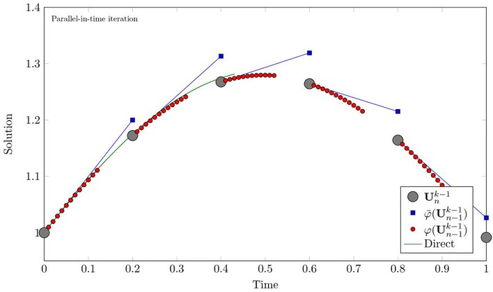

# ParaReal
## Group Members
Spencer Lee

## Abstract

Parareal is an iterative numerical algorithm for solving initial value problems.
The method was introduced in 2001 Lions, Maday and Turinci. What makes this method
unique is that it allows for parallel-in-time integration. When being
parallelized, most numerical methods seek to parallelze the computation in
space. For example, a single processor processor may be devoted to evolving a
particular dimension of an equation over time. Parareal, on the other hand,
devotes a single processor to evolving an equation over a particular time
interval.

This is complicated by causality, the fact that the value of an equation in one
point in time is dependent on its value at previous points in time. At first,
this may appear to make parallel-in-time integration impossible; one processor
cannot evolve the equation over its given time period until the equation is
evolved over all prior time intervals. However, the parareal algorithm cleverly
uses multiple shooting along the time axis to discretize the equation in space.

The basic premise is this:
1. A computationally cheap "coarse" solver numerically solves the initial value
   problem using only a few timesteps.
2. Each timestep of the course solver defines an initial value problem over that
   interval. More expensive "fine" solvers solve them in parallel, resulting in
   more accurate solutions at each point the coarse solver calculated.
3. Repeat step 2, using the corrected points obtained by the fine solvers as
   as more accurate initial values for each interval, resulting in more accurate
   solutions. Do this until acceptable accuracy is reached.

An illustration of the parareal algorithm:

(credit: https://en.wikipedia.org/wiki/Parareal)

An interesting tradeoff to the parareal algorithm is that more computations are
used to evaluate the fine propogators for several iterations than would be used
by one fine propogator operating over the entire time interval to achieve the
same level of accuracy. Therefore, the parareal algorithm uses more power than a
serial implementation in order to achieve higher speed.

In this project, I will implement the parareal algorithm in the C/C++ programming
language. Since the primary purpose of the parareal algorithm is speed, it would
be most sensible to implement it in C or Fortran. I am not familiar with
Fortran, so C is the most sensible option. 

In my research, I am generally studying the use of numerical methods for fast
integration of highly oscillatory equations. In particular, for solving
Schrodingers equation, for the purpose of simulating quantum computing (both for
studying the uses of quantum computing, and for usage in quantum gate controls).
Currently, I have been adapting Spectral Deferred Correction methods for use in
highly oscillatory equations. SDC is a method for turning a low-order ODE solver
into an arbitrary order solver. Interestingly, the prediction-correction scheme
used to achieve SDC is somewhat similar to the way parareal works.

A hybrid between parareal and spectral deferred correction methods was
introduced by Minion in 2008. Since I am currently studying Spectral
deferred correction as part of my research, combining the two methods and
studying their efficacy will be a natural extension of the topic for me. In
particular, I am currently in the process of creating an open-source package
implementation of Spectral Deferred Correction methods in the Julia programming
language, a high-performance, high-level language popular for scientific
computing. A Julia package for the parareal algorithm already exists. If possible, I
would like to create a Julia package for the hybrid method as well. However,
this may be outside the scope that the timeframe of this project allows. Whether
the hybrid parareal SDC method will be studied will be decided later on in the
project.

I will test the speed and accuracy of these methods on various equations,
increasing in complexity until they are applied to Schrodingers equation, if
time allows. 

## Parallelization Strategies

In my C implementation of the parareal algorithm, I will use either the MPI or
OpenMP libraries to achieve parallel computation. Which one is more fitting
I will not know until I have learned more about MPI, but I suspect MPI will be
better for distributed computing and allow for greater parallelism, so using MPI
will be my target. But either way, OpenMP can be used as a fallback. 

I will also consider using CUDA to use GPUs to implement the parareal algorithm.
But I suspect that a smaller number of higher-power CPUs will be more
appropriate for parallel than the many low-power CPUs of a GPU.

In my Julia implementation of the hybrid parareal SDC algorithm I will use
either the `Distributed` standard library, which enables distributed computing
in Julia, or the `MPI.jl` package, which provides access to MPI libraries. If I
program parareal in C using MPI instead of OpenMP, then I will use `MPI.jl` in
Julia, so that code will convert more easily between C and Julia.

The Julia GPU comiler provides the ability to run Julia code natively on GPUs. I
will consider this as an option, but since the scope of this project may already
be too large when implementing the hybrid parareal SDC method, I am not counting
on trying to implement GPUs in Julia (and I am unsure of how good the support
for this is in the first place).

## Benchmark and Optimization

Benchmarking and Optimization will be very important to this project because the
main use-case of parareal is in applications where speed is important enough to
justify the increased power usage. Typically this means applications where the
evalutation must be completed prior to some event occuring. In weather
prediction, for example, we want to predict the weather at some point in the
future *before* we actually reach that point in time (if we did we would just
take another sample of data, and the work done on the algorithm would be
worthless).

As such, there are usually real external time constraints on the algorithm, so
understanding the time taken by the algorithm is of the utmost importance. It
would also be interesting to compare the time taken to the extra power used to
perform parareal instead of the serial implementation - to determine
quantitatively if the extra power cost is justified by the speedup.

We will monitor:
1. Speed
2. Accuracy
3. Power Comsumption

### Speed
Speed will be measured using the `chrono` c++ library and `ctime` C library.
Measuring the speed of parareal will not be especially difficult: we simply need
to measure the amount of time taken over the whole method, and compare it to the
number of operations/iterations performed in the algorithm, which we know a
priori. But since this is a very high-performance application, it is important
that we measure time with high precision. The `chrono` library is well-suited
for this task.

In the Julia programming language we will use the `BenchmarkTools.jl` library
for measuring speed. Measuring speed in Julia will be trickier than for C
because of Julia's "just-ahead-of-time" compiler. The compilation of code may
impact the performance measured, even though we are not really interested in the
time spent compiling code as part of the method.

It would also be useful to mention not just the speed of the entire method, but
of the time taken by each fine solver in the parareal algorithm. Since every
fine solver must finish before the next run of the fine solvers, we are only as
fast as our slowest link. As such, we should monitor whether any individual fine
solvers are running slower than the other ones running in parallel.

The main goal for speed is for the parareal implementation to run faster than
the serial solution where we simply use one fine solver (with the same
granularity as the fine solvers in parareal) over the entire initial value
problem. We will also look for real-world applications with real benchmarks to
meet.

We will also measure the strong and weak scaling of the algorithm. If we adhere
rigorously the definitions of these teams, this would mean comparing the time
taken for the parareal algorithm (i.e. with coarse and fine propogators,
multiple iterations) using different numbers of CPUs. This is not exactly a
useful metric, since performing the parareal algorithm with a single CPU would
just be using more computations to obtain the same results (we would be using
the coarse propogator results at the start of each interval even when we have
the more accurate fine propogator results available). Consequently, it would be
a better idea to define some metrics "pseudo-strong" and "pseudo-weak" scaling,
which we will use to quantify the benefits of using the parareal algorithm in
parallel compared to using the serial method (which is distinct from the
parareal algorithm).

It would also be nice to create some fancy animations comparing the speed of
parareal to the speed of the serial implementation in a visual and very
accessible way.

### Accuracy
Accuracy will be measured by using the parareal algorithm on equations with
analytical solutions, and comparing the numerical result with the analytical
result.

We can also study the accuracy of parareal by comparing the results obtained
using parareal with the results obtained using a numerical solver with more
timesteps (this may just be a higher granularity run of parareal, with no regard
for how long it takes).

### Power Consumption
I am not sure how to measure power consumption. One idea is just to measure the
number of floating point and arithmetic operations performed by parareal
compared to the serial algorithm, which we know analytically. On the other hand,
there will also be overhead in the program, especially pertaining to
implementation of parallelism, which will be more difficult to quantify. The
best option may be to simply measure the total CPU time used. This will not
correlate exactly to the power used by all the CPUs, but it would measure
the resources used from the perspective of someone who wants to allocate
available nodes in a high-performance computing center.  

## Summary
### Primary Goals
These are the main goals of this project. Completing these tasks would
constitute a successful project.
1. Implement the parareal algorithm in C/C++ using OpenMP and/or MPI, or
   possibly even utilizing GPUs through CUDA.
2. Obtain performance faster than the serial implementation, but with the same
   accuracy, on initial value problems relevant to some application area
   (ideally Schrodinger's equation, but possibly other equations arising in
   weather prediction or power grid management).
3. Compare results of C/C++ implementation with results obtained using the
   existing parareal package in Julia
4. Compare efficacy of parareal across multiple classes of initial value
   problems

### Secondary Goals
These are the secondary/optional goals of this project. They are either small
but unintegral to the project, or large enough that they may be outside the
scope of the project. Completing these tasks would costitute a very successful
project, but the project can still succeed without them.
1. Implement a hybrid-parareal-SDC method in Julia
2. Make the method available as an open-source package
3. Create fancy animations which illustrate the speedup of parareal compared to
   serial methods.

## References
Parareal Algorithm: https://www.semanticscholar.org/paper/The-parareal-in-time-algorithm-Maday/2d51619eb5d9a281cb26d48243a3ee5c7036e795
Parareal for Oscillatory Equations: https://www.sciencedirect.com/science/article/pii/S0021999121001777
Spectral Deferred Correction: https://link.springer.com/article/10.1023/A:1022338906936
Parareal Spectral Deferred Correction: https://msp.org/camcos/2010/5-2/p05.xhtml
Parareal Implementation in Julia: https://arxiv.org/pdf/1706.08569.pdf
Parallel Computing in Julia: https://docs.julialang.org/en/v1/manual/parallel-computing/
